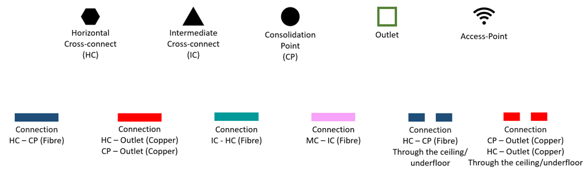

# BUILDING 4

> ## Measurements
> The following figures represents all measurements considered on both floors.
>
>   
_**Figure 1** - Ground floor measurements_
>
>  
_**Figure 2** - Floor 1 measurements_
>
> These measurements were important to the calculation of the number of outlets for each room, having in mind the structured cabling standards that specify a ratio of two outlets for every 10 square meters of area. In the following image, it is presented the measurements of each room (adding the area to the calculations above), and the number of outlets to be deployed in each one.
>
>  
_**Figure 3** - Measurements table_

After measuring every room, it was time to implement the schematic plan regarding network outlets, cross-connects and cable pathways deployment.
>
> ## Floors design 
> The following figures have represented the schematic plan for both floors.
>
>  
_**Figure 4** - Figures legend_
> 
>  
_**Figure 5** - Ground Floor Design_
>
> As we can see, the IC and HC on the ground floor are located in the storage area, housed in appropriate telecommunications enclosure, and the IC directly connects to the HC to the floor above. 
>
> Regarding wireless connection, an access point is located in room 4.0.2 granting a 50 meters diameter circle coverage, enough to reach every area of the building.
>
> On this floor, there are 4 consolidation points in rooms whose density of outlets justified its implementation.
>
> Every outlet on the wall is placed 50 centimeters above the ground, as well as the consolidation points. The others were placed in the ground.
>
>  
_**Figure 6** - Floor 1 Design_
> 
> In the first floor, a HC is located in the storage area as well. The cables are installed in the dropped ceiling until the destination room is reached. 
>
> Consolidation points were also installed in rooms with high density of outlets (a total of 4 CPs).
>
> No wireless access point was installed, due to the access point located on the ground floor granting connection to every place of the building.
>
> The outlets and consolidation points on the wall were also placed 50 centimeters above the ground. The other ones were installed in the ground.

Finally, concerning the inventory required for both floors, these were our choices.

> # Inventory #
>> ### **Measurements**
>>> #### Cable
>>>
>>> * MC to IC: 26,17 m fibre cable
>>>
>>> * IC to HC: 1 m fibre cable
>>>
>>> * IC to HC from floor 1: 9,6 m fibre cable
>>
>>> #### Ground Floor
>>>
>>> * HC to CP (4.0.1): 28,31 m fibre cable
>>>
>>> * CP to outlets (4.0.1): 56,4 m copper cable 
>>>
>>> * HC to CP (4.0.2): 24,56 m fibre cable
>>>
>>> * CP (4.0.2) to outlets: 49,05 m copper cable 
>>>
>>> * HC to CP (4.0.3): 20,85 m fibre cable
>>>
>>> * CP (4.0.3) to outlets: 34,82 m copper cable 
>>>
>>> * HC to CP (4.0.4): 20,1 m fibre cable 
>>>
>>> * CP (4.0.4) to outlets: 103,42 m copper cable
>>>
>>> * HC to outlets (4.0.6 and 4.0.7): 91,46 m fibre cable
>>>
>>> * CP (4.0.1) to CP (4.0.2): 6,77 m fibre cable
>>>
>>> * CP (4.0.1) to CP (4.0.3): 10,41 m fibre cable
>>>
>>> * CP (4.0.1) to CP (4.0.4): 11,1 m fibre cable
>>>
>>> * CP (4.0.2) to CP (4.0.3): 6,78 m fibre cable
>>>
>>> * CP (4.0.2) to CP (4.0.4): 7,29 m fibre cable
>>>
>>> * CP (4.0.3) to CP (4.0.4): 3,74 m fibre cable
>>
>>> #### Floor 1
>>>
>>> * HC to CP (4.1.2): 4,72 m fibre cable 
>>>
>>> * CP (4.1.4) to outlets: 159,31 m copper cable 
>>>
>>> * HC to CP (4.1.1): 28,18 m fibre cable
>>>
>>> * CP (4.1.1) to outlets: 573,09 m copper cable 
>>>
>>> * CP (4.1.1) to outlets: 527,85 m copper cable // com update
>>>
>>> * HC to CP (4.1.5): 16,98 m fibre cable 
>>>
>>> * CP (4.1.5) to outlets: 187,91 m copper cable 
>>>
>>> * HC to CP (4.1.7): 20,29 m fibre cable 
>>>
>>> * CP (4.1.7) to outlets: 133,67 m copper cable 
>>>
>>> * CP (4.1.4) to CP (4.1.1): 26,83 m fibre cable
>>>
>>> * CP (4.1.4) to CP (4.1.5): 17,88 m fibre cable
>>>
>>> * CP (4.1.4) to CP (4.1.7): 21,19 m fibre cable
>>>
>>> * CP (4.1.1) to CP (4.1.5): 39,99 m fibre cable
>>>
>>> * CP (4.1.1) to CP (4.1.7): 43,3 m fibre cable
>>>
>>> * CP (4.1.5) to CP (4.1.7): 10,79 m fibre cable
>>>
>>> *Note*: The type of the fibre cables used is monomode optical fibre and the copper cables used is CAT7.
>>
>> ### **Network Outlets**
>>> #### Ground Floor
>>>
>>>  * 43 outlets (1 for wireless access point)
>>
>>> #### First Floor
>>>  * 60 outlets
>> ### **Patch Panels**
>>> #### Ground Floor
>>>  * 1 fibre patch panel with 48 ports (IC)
>>>  * 1 fibre patch panel with 48 ports (HC)
>>>  * 1 cobber (CAT7) patch panel with 24 ports (HC)
>>
>>> #### First Floor
>>>  * 1 fibre patch panel with 48 ports (HC)
>>>  * 1 fibre patch panel with 24 ports (HC)
>>>
>>> *Note*: All unused ports are there to prevent building growth)
>>
>> ### **Access Points**
>>> #### Ground Floor
>>>
>>>  * 1 access point
>>
>> ### **Consolidation Points**
>>>
>>> #### Ground Floor
>>>
>>> * 4 consolidation points with 24 ports
>>
>>> #### First Floor
>>>
>>> * 4 consolidation points with 24 ports

