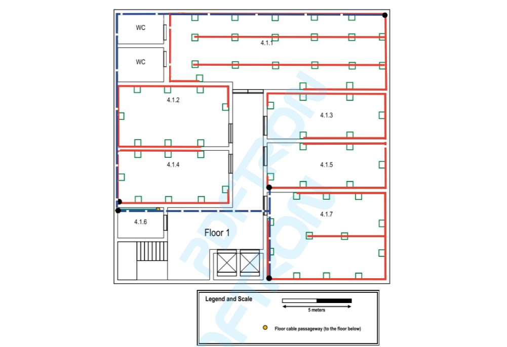

RCOMP 21/22 - Sprint 1 - 1201276
===========================================

This md file will contain all explanations and justifications about the choices taken during the realization of the sprint.

>>## These were the followed structured cabling standards:
>
>>- Minimum of 2 outlets per work area.
>>- Proportion of 2 outlets for every 10 square meters of area.
>>- Patch cords can reach up to 5 meters.
>>- There must always be an outlet less than 3 meters from the user's equipment.
>>- Work areas require copper cable outlets.
>>- Each cable length should be less than 90 meters.
>>- The total area covered by a horizontal cross-connect should be less than 1000 m2.
>>- Straight line distance between the horizontal cross-connect and the outlet should be less than 80 meters.
>>- Cables connecting an intermediate cross-connect (IC) to a horizontal cross-connect (HC) are limited to 500 meters in length.
>>- Cables connecting the main cross-connect (MC) to an IC are limited to 1500 meters in length.
>>- The number of cables entering a telecommunications cabinet must always be less than 200.

# Building 4

> ## Measurements
> The following figures represents all measurements considered on both floors.
>
>   
_**Figure 1** - Ground floor measurements_
>
>  
_**Figure 2** - Floor 1 measurements_
>
> These measurements were important to the calculation of the number of outlets for each room, having in mind the structured cabling standards that specify a ratio of two outlets for every 10 square meters of area. In the following image, it is presented the measurements of each room (adding the area to the calculations above), and the number of outlets to be deployed in each one.
>
>  
_**Figure 3** - Measurements table_
>
> *Note:* Room 4.0.2 has 7 outlets instead of the expected 6 since one of them is being used by the wireless access point.

After measuring every room, it was time to implement the schematic plan regarding network outlets, cross-connects and cable pathways deployment.
>
> ## Floors design 
> The following figures have represented the schematic plan for both floors.
>
>  
_**Figure 4** - Figures legend_
> 
>  
_**Figure 5** - Ground Floor Design_
>
> As we can see, the IC and HC on the ground floor are located in the storage area, housed in appropriate telecommunications enclosure, and the IC directly connects to the HC to the floor above. 
>
> Regarding wireless connection, an access point is located in room 4.0.2 granting a 50 meters diameter circle coverage, enough to reach every area of the building.
>
> On this floor, there are 4 consolidation points in rooms whose density of outlets justified its implementation.
>
> Every outlet on the wall is placed 1 meter above the ground granting that there is always an outlet with a distance less than 3 meters away from where our equipment is placed. The others were placed in the ground. Near doors, the outlets were a bit displaced so the door could be smoothly openned and closed.
>
>  
_**Figure 6** - Floor 1 Design_
> 
> On the first floor, an HC is located in the storage area as well. The cables are installed in the dropped ceiling until the destination room is reached. 
>
> Consolidation points were also installed in areas with high density of outlets (a total of 4 CPs).
>
> No wireless access point was installed, due to the access point located on the ground floor granting connection to every place of the building.
>
> The outlets were mainly placed on the wall. The other ones were installed in the ground. Consolidation points were placed in the dropped ceilling. Like in the ground floor, near the doors the outlets were a bit displaced.

Finally, concerning the inventory required for both floors, these were our choices.

> # Inventory #
>> ### **Measurements**
>>> #### Cable
>>> All the "* 8 " in the fibre connections refer to redundancy, this is, alternative cabling in case of failure/technical issues.
>>>
>>> * MC to IC: 26,17 m * 8 = 209,36 m fibre cable
>>>
>>> * IC to HC: 1 m * 8 = 8 m fibre cable
>>>
>>> * IC to HC from floor 1: 9,6 m * 8 = 76,8 m fibre cable
>>
>>> #### Ground Floor
>>>
>>> * HC to CP (4.0.1): 28,31 m * 8 = 226,48 m fibre cable
>>>
>>> * CP to outlets (4.0.1): 56,4 m copper cable 
>>>
>>> * HC to CP (4.0.2): 24,56 m * 8 = 196,48 m fibre cable
>>>
>>> * CP (4.0.2) to outlets: 49,05 m copper cable 
>>>
>>> * HC to CP (4.0.3): 20,85 m * 8 = 166,8 m fibre cable
>>>
>>> * CP (4.0.3) to outlets: 34,82 m copper cable 
>>>
>>> * HC to CP (4.0.4): 20,1 * 8 = 160,8 m fibre cable 
>>>
>>> * CP (4.0.4) to outlets: 103,42 m copper cable
>>>
>>> * HC to outlets (4.0.6 and 4.0.7): 91,46 m copper cable
>>>
>>> * CP (4.0.1) to CP (4.0.2): 6,77 m fibre cable
>>>
>>> * CP (4.0.1) to CP (4.0.3): 10,41 m fibre cable
>>>
>>> * CP (4.0.1) to CP (4.0.4): 11,1 m fibre cable
>>>
>>> * CP (4.0.2) to CP (4.0.3): 6,78 m fibre cable
>>>
>>> * CP (4.0.2) to CP (4.0.4): 7,29 m fibre cable
>>>
>>> * CP (4.0.3) to CP (4.0.4): 3,74 m fibre cable
>>>
>>> * **Total cable length for end users (5 meters each): 43 * 5 = 215 m**
>>>
>>> * **Total cable length connecting to outlets: 335,15 m**
>>>
>>> * **Total fibre cable length inside TE (0.5m each): 96 * 0.5 * 2 = 96 m**
>>>
>>> * **Total copper cable length inside TE (0.5m each): 24 * 0.5 = 12 m**
>>
>>> #### Floor 1
>>>
>>> * HC to CP (4.1.2): 4,72 m * 8 = 37,76 m fibre cable 
>>>
>>> * CP (4.1.4) to outlets: 159,31 m copper cable 
>>>
>>> * HC to CP (4.1.1): 37,15 m * 8 = 297,2 m fibre cable
>>>
>>> * CP (4.1.1) to outlets: 220,22 m copper cable
>>>
>>> * HC to CP (4.1.5): 16,98 m * 8 = 135,84 m fibre cable 
>>>
>>> * CP (4.1.5) to outlets: 187,91 m copper cable 
>>>
>>> * HC to CP (4.1.7): 20,29 m * 8 = 162,32 m fibre cable 
>>>
>>>* CP (4.1.7) to outlets: 133,67 m copper cable 
>>>
>>> * CP (4.1.4) to CP (4.1.1): 26,83 m fibre cable
>>>
>>> * CP (4.1.4) to CP (4.1.5): 17,88 m fibre cable
>>>
>>> * CP (4.1.4) to CP (4.1.7): 21,19 m fibre cable
>>>
>>> * CP (4.1.1) to CP (4.1.5): 49,19 m fibre cable
>>>
>>> * CP (4.1.1) to CP (4.1.7): 52,54 m fibre cable
>>>
>>> * CP (4.1.5) to CP (4.1.7): 10,79 m fibre cable
>>>
>>> * **Total cable length for end users (5 meters each): 60 * 5 = 300 m**
>>>
>>> * **Total cable length connecting to outlets: 701,11 m**
>>>
>>> * **Total fiber cable length inside TE (0.5m each): 72 * 0.5 * 2 = 72 m**
>>>
>> *Note*: The type of the fibre cables used is monomode optical fibre, ideal for longer cable lengths and immune to dispersion allowing higher data rates, and for the end user equipments we connected copper cables CAT7 due to most of the current end user hardware not providing an optical connection.
>>
>> ### **Network Outlets**
>>> #### Ground Floor
>>>
>>>  * 43 outlets (1 for wireless access point)
>>
>>> #### First Floor
>>>  * 60 outlets
>> ### **Patch Panels**
>>> #### Ground Floor
>>>  * 1 fibre patch panel with 48 ports (IC)
>>>  * 1 fibre patch panel with 48 ports (HC)
>>>  * 1 copper (CAT7) patch panel with 24 ports (HC)
>>
>>> #### First Floor
>>>  * 1 fibre patch panel with 48 ports (HC)
>>>  * 1 fibre patch panel with 24 ports (HC)
>>>
>>> *Note*: All unused ports are there to prevent building growth
>>
>> ### **Access Points**
>>> #### Ground Floor
>>>
>>>  * 1 access point with 50 meters diameter granting full wireless LAN (Wi-Fi) coverage to the whole building.
>>
>> ### **Consolidation Points**
>>>
>>> #### Ground Floor
>>>
>>> * 4 consolidation points with 24 copper ports and 24 fibre ports
>>
>>> #### First Floor
>>>
>>> * 4 consolidation points with 24 copper ports and 24 fibre ports
>> ### **Telecommunication enclosure**
>>> #### Ground Floor
>>> * 16U ~= (1.5x2x2U + 1.5x2x2U + 1.5x2x1U)
>>
>>> #### First Floor
>>> * 9U (1.5x2x2U + 1.5x2x1U)

