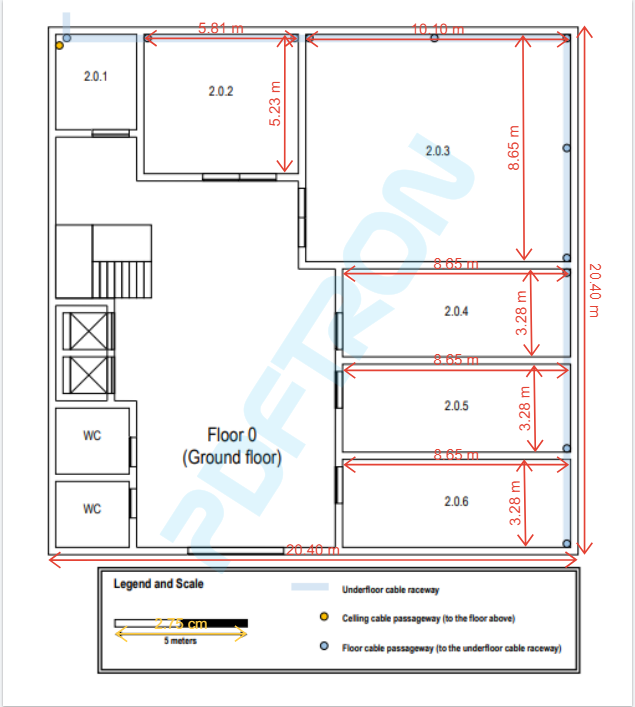
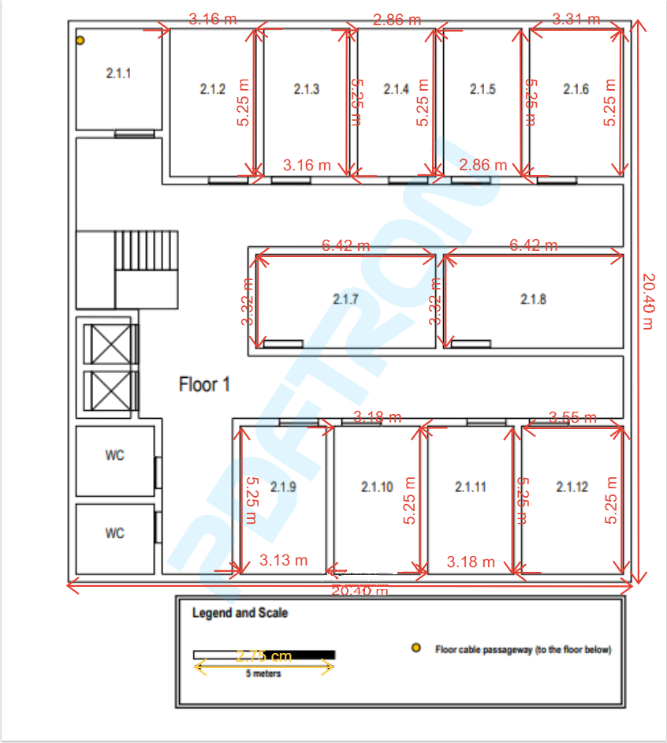
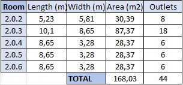
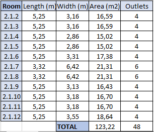
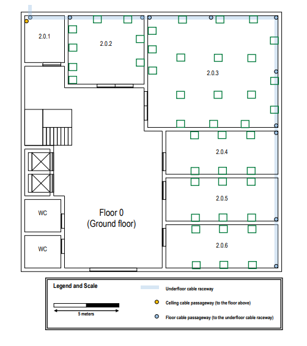
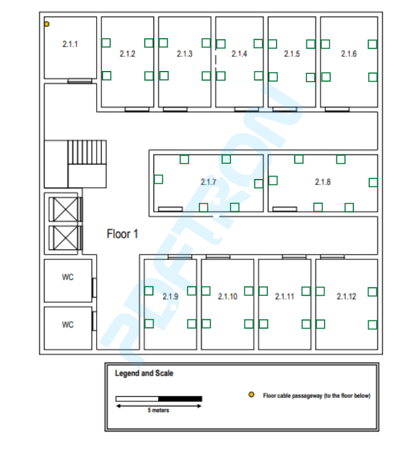
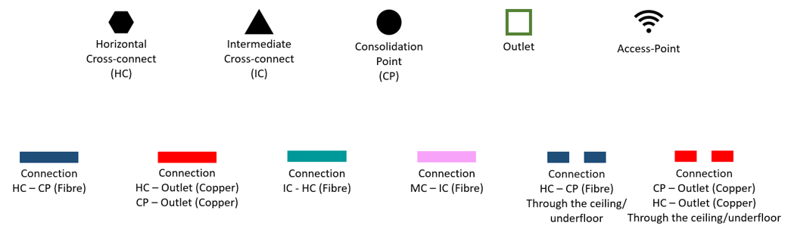
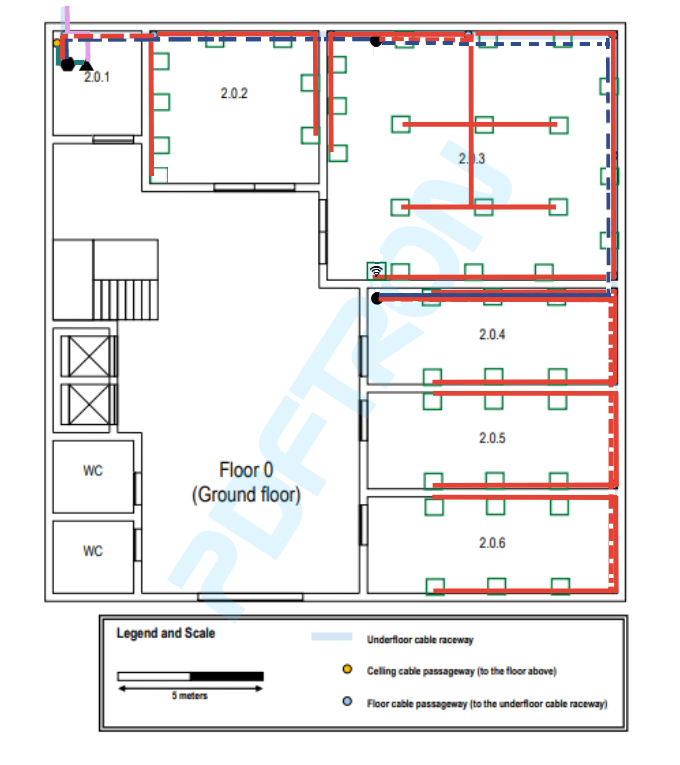
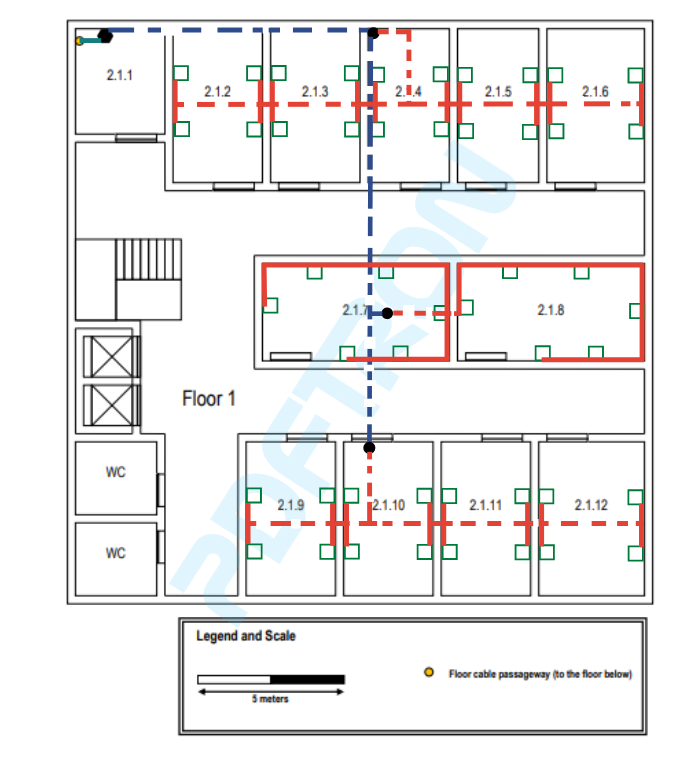

RCOMP 21/22 - Sprint 1 - 1201371
===========================================

This md file will contain all explanations and justifications about the choices taken during the realization of the sprint.

>>## These were the followed structured cabling standards:
>
>>- Minimum of 2 outlets per work area.
>>- Proportion of 2 outlets for every 10 square meters of area.
>>- Patch cords can reach up to 5 meters.
>>- There must always be an outlet less than 3 meters from the user's equipment.
>>- Work areas require copper cable outlets.
>>- Each cable length should be less than 90 meters.
>>- The total area covered by a horizontal cross-connect should be less than 1000 m2.
>>- Straight line distance between the horizontal cross-connect and the outlet should be less than 80 meters.
>>- Cables connecting an intermediate cross-connect (IC) to a horizontal cross-connect (HC) are limited to 500 meters in length.
>>- Cables connecting the main cross-connect (MC) to an IC are limited to 1500 meters in length.
>>- The number of cables entering a telecommunications cabinet must always be less than 200.

#Building 2

> ##Measurements
> The following figures represents all measurements considered on both floors.
> 
>  
_**Figure 1** - Ground floor measurements_
>
>  
_**Figure 2** - First floor measurements_
> 
> As we can see in the legend of both figures, there are represented the scale used on the calculation of these measures (2,75cm = 5m). 
> These measurements will be important in the calculation of the number of outlets by room. So, as is referred to in the sprint description, the storage area (2.0.1 and 2.1.1), restrooms, and the entrance hall are not required to have outlets in there, so the mesurements of these places are ignored.
> ##Outlet design
> 
> After having all measurements of both floors, we can go on to the outlet calculation and design. To calculate the number of outlets by room, we use the 2 outlets by 10m^2 rule.
> 
>  
_**Figure 3** - Ground Floor Outlet Calculation_
> 
>  
_**Figure 4** - First Floor Outlet Calculation_
> 
> After this, the next step is to plan the design of the outlets in the rooms. To do that, we have to grant that any place in the room has an outlet with a distance smaller than 3 meters.
> 
>  
_**Figure 5** - Ground Floor Outlet Design_
>
>  
_**Figure 6** - First Floor Outlet Design_
> 
> The outlets have priority to be placed in the walls, because it is not convenient to have outlets and gutters all over the ground. 
> Furthermore, the outlets are located enough for the door to open and close smoothly.

Having the outlet design for both floors, it's time to proceed to both final designs themselves.

> ##Floors design
> The following figures has represented the design for the ground floor.
> 
>  
_**Figure 7** - Figures legend_
> 
>  
_**Figure 8** - Ground Floor Design_
> 
> As we can see, on this floor we have an HC and IC localized in the storage area, being that IC supports the building (both floors) and HC supports the floor. The cables go through the underfloor cable raceway to reach other rooms. 
> The access-point is localized in the ceiling of the 2.0.3 room, so it is the most centered room in our floor. The range radius of the access-point is 25 meters long, so it is not a problem to cover the floor with wi-fi connection. 
> The CPs are placed in the room 2.0.4 and 2.0.3 because there are a great concentration of outlets in the rooms nearby. 
> 
> The following figure has represented the design for the first floor.
>
>  
_**Figure 9** - Ground Floor Design_
>
> The HC of this floor is located in the storage area. The cables go through the dropped ceiling until the pretended room is reached. In the rooms, the cable is carried through the wall, where it is supported by gutters until reach the specific outlet. 
> There are no access-point. The ground floor one is enough to cover the first floor too. 
> The CPs are placed in the dropped ceiling of rooms 2.1.4, 2.1.7 and 2.1.10 and covering the 3 populated areas. 

Remains analyze the inventory required for these designs.
>> ##Inventory
> 
> ###Cable
>>
> All the " * 8 "in the fibre connecting is about the redundancy.
>>
>> **MC(Other ICs)(indoor) to IC : 2.2m x 8 = 17.6m**
>> 
>> **IC to Other ICs: 2.2m x 24(8 for each building) = 52.8m**
>>
>> **IC to HC : 0.3m x 8 = 2.4m**
>> 
>> **IC to Floor 1 HC: 2.4m x 8= 19.2**
>> 
>> **HC to HC : 2m x 8 = 16m**
>> 
>>####**Floor 0**
>> 
>> HC to CP(2.0.3): 11.75m x 8 = 94m
>> 
>> HC to CP(2.0.4): 37.7m x 8 = 301.6m
>> 
>> HC to outlets: 68.35m
>> 
>> CP(2.0.3) to outlets: 234.45m + 4m (access point no teto)
>> 
>> CP to CP: 9.15m
>> 
>> CP(2.0.4) to outlets: 362.9m
>> 
>> **Total cable length connecting to outlets: 656.7m**
>> 
>> **Total cable length for end users (5 meters each): 44 x 5 = 220m**
>> 
>> **Total fibre cable length inside TE (0.5m each): 96 x 0.5 x 2 = 96m**
>>
>> **Total copper cable length inside TE (0.5m each): 24 x 0.5 = 12m**
>>
>
>> ####**Floor 1**
>> 
>> HC to CP(2.1.4): 9.60m x 8 = 76.8m
>> 
>> HC to CP(2.1.7): 20.25m x 8 = 162m
>> 
>> HC to CP(2.1.10): 24.30m x 8 = 194.4m
>> 
>> 
>> CP(2.1.4) to outlets: 180.5m + 20m (1 meter for each outlet (descent of the dropped ceiling))
>> 
>> 
>> CP(2.1.7) to outlets: 99.2m + 12m (1 meter for each outlet (descent of the dropped ceiling))
>> 
>> CP(2.1.10) to outlets: 173.71m + 16m (1 meter for each outlet (descent of the dropped ceiling))
>> 
>> CP(2.1.4) to CP(2.1.7):10.65m 
>> 
>> CP(2.1.4) to CP(2.1.10):10.70m
>> 
>> CP(2.1.7) to CP(2.1.10): 5.25m
>>
>> **Total CPs to outlets: 453.41m + 48m  (1 meter for each outlet (descent of the dropped ceiling))**
>>
>> **Total cable length for end users (5 meters each): 48 x 5 = 240m**
>>
>> **Total fibre cable length inside TE (0.5m each): 48 x 0.5 x 2 = 48m**
>>
>
>> ###Outlets
>>####Ground Floor
>>
>>  * 45 outlets
>>
>>####First Floor
>>
>> * 48 outlets
>
>>###Patch Panels
>>####Floor 0
>>
>>  * 1 fibre patch panel with 48 ports (IC)
>>  * 1 fibre patch panel with 48 ports (HC)
>>  * 1 copper (CAT7) patch panel with 24 ports (HC)
>>
>>####Floor 1
>>
>>  * 1 fibre patch panel with 48 ports (HC)
>>
>> *Note*: All unused ports are there to prevent building growth)
> 
>>###Access Points
>>####Ground Floor
>>
>>  * 1 access point
>
>>###Consolidation Points
>>
>>####Ground Floor
>>
>>  * 2 consolidation points with 24 copper ports and 24 fibre ports each 
>>
>>####First Floor
>>
>>  * 3 consolidation points with 24 copper ports and 24 fibre ports
>
>
>>###Telecommunication enclosure
>>
>>####Floor 0
>>
>> * (2x1.5x2U) + (2x1.5x2U) + (2x1.5x1U) ~= 16U 
>>
>>####Floor 1
>>
>> * (2x1.5x2U) = 6U