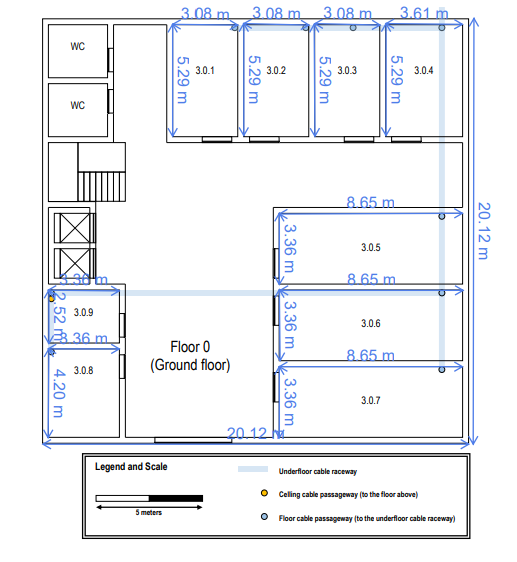
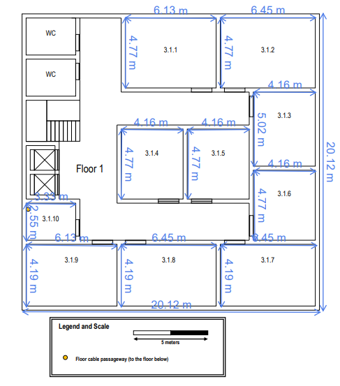
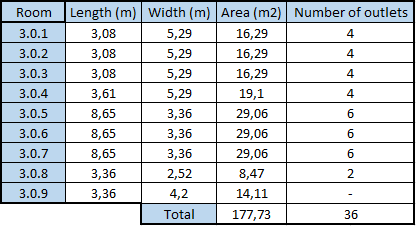
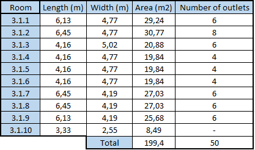
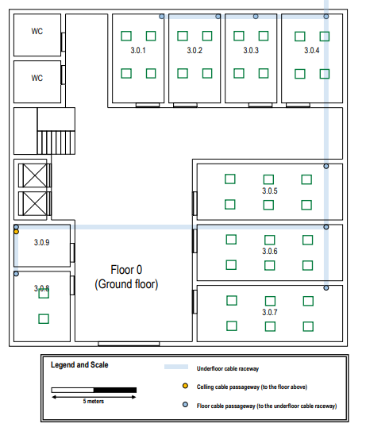
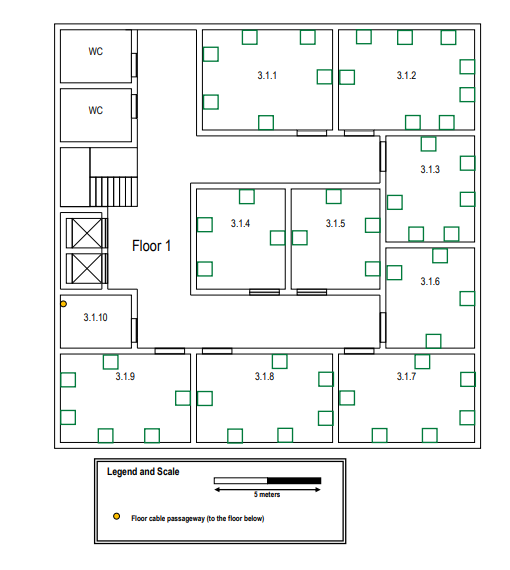
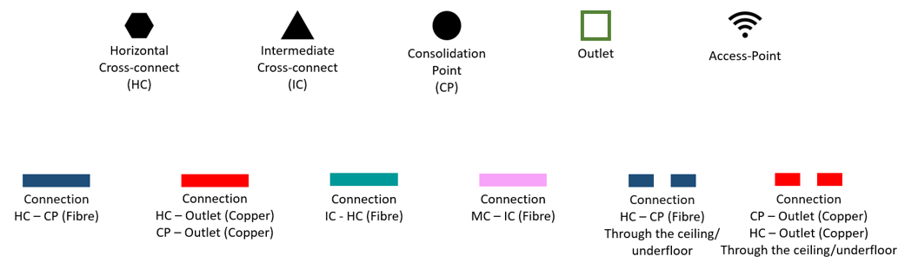
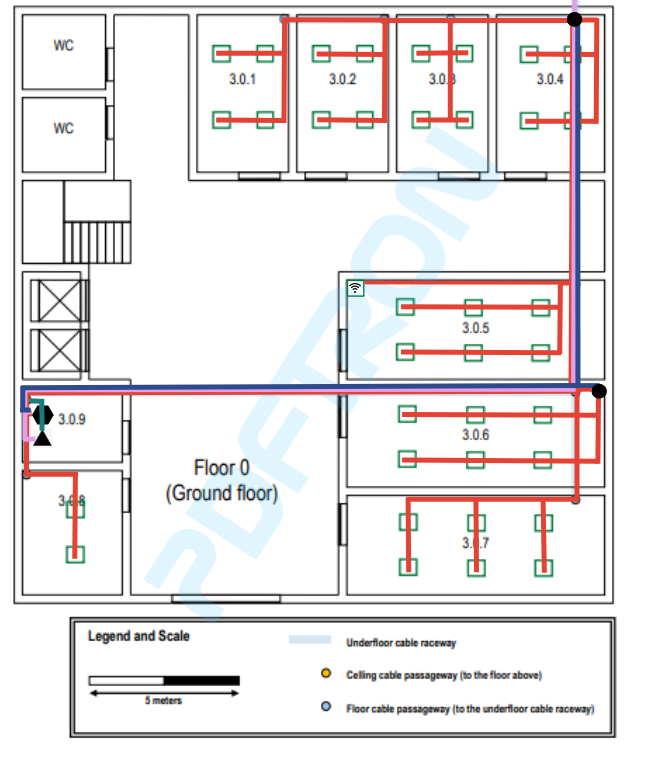
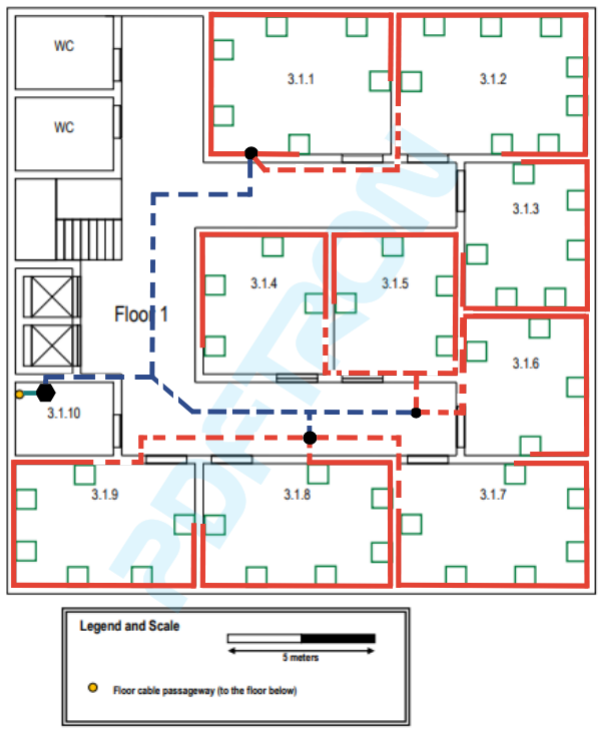

RCOMP 21/22 - Sprint 1 - 1201381
===========================================

This md file will contain all explanations and justifications about the choices taken during the realization of the sprint.

#Building 3

> ##Measurements
> The following figures represents all measurements considered on both floors.
> 
>  
_**Figure 1** - Ground floor measurements_
>
>  
_**Figure 2** - First floor measurements_
> 
> As we can see in the legend of both figures, there are represented the scale used on the calculation of these measurements (2,8cm = 5m). 
> These measurements will be important in the calculation of the number of outlets by room. So, as is referred to in the sprint description, the storage area (3.0.9 and 3.1.10), restrooms, and the entrance hall are not required to have outlets in there, so the measurements of these places are ignored.
> ##Outlet design
> 
> After having all measurements of both floors, we can go on to the outlet calculation and design. To calculate the number of outlets by room, we use the 2 outlets by 10m^2 rule.
> 
>  
_**Figure 3** - Ground Floor Outlet Calculation_
> 
>  
_**Figure 4** - First Floor Outlet Calculation_
> 
> After this, the next step is to plan the design of the outlets in the rooms. To do that, we have to grant that any place in the room has an outlet with a distance smaller than 3 meters.
> 
>  
_**Figure 5** - Ground Floor Outlet Design_
>
>  
_**Figure 6** - First Floor Outlet Design_
> 
> The main difference in that picture is that on the ground floor, the outlets are placed in the floor and on the first floor, the outlets are placed in the walls, because it is not convenient and realistic have outlets in the ground with the cables emerging from the dropped ceiling. In the ground floor it is possible because the cable raceways are located in the floor. 
> Furthermore, the outlets are located enough for the door to open and close smoothly.

Having the outlet design for both floors, it's time to proceed to both final designs themselves.

> ##Floors design
> The following figures has represented the design for the ground floor.
> 
>  
_**Figure 7** - Figures legend_
> 
>  
_**Figure 8** - Ground Floor Design_
> 
> As we can see, on this floor we have an HC and IC localized in the storage area, being that IC supports the building (both floors) and HC supports the floor. The cables go through the underfloor cable raceway to reach other rooms. 
> The access-point is localized in 3.0.5 room, so it is the most centered room in our floor. The range radius of the access-point is 50 meters long, so it is not a problem to cover the floor with wi-fi connection. 
> The CPs are placed in 3.0.6 and 3.0.4 because there are a great concentration of outlets. 
> 
> The following figure has represented the design for the first floor.
>
>  
_**Figure 9** - Ground Floor Design_
>
> The HC of this floor is located in the storage area. The cables go through the dropped ceiling until the pretended room is reached. In the rooms, the cable is carried through the wall, where it is supported by gutters until reach the specific outlet. 
> There are no access-point. The ground floor one is enough to cover the first floor too. 
> The CPs are placed in the dropped ceiling and covering the 3 populated areas. 

Remains analyze the inventory required for these designs.

> ##Inventory
> First, we will calculate the total amount of cable that is required.
> 
>> ###Cable
>> * MC(indoor) to IC: 18.50 + 26.00 + 2.33 = 46.83m fibre cable
>> 
>> * IC to HC: 0.4m fibre cable
>>
>> * IC to Floor 1 HC: 2.1 + 0.75 = 2.85m fibre cable
>>
>> * HC to HC: 0.7 + 0.75 = 1.45m fibre cable
>>####Ground Floor
>>
>> * HC to CP(3.0.6): 28.34m fibre cable
>>
>> * HC to CP(3.0.4): 44.70m fibre cable
>>
>> * CP to CP: 18.78m fibre cable
>>
>> * HC to outlets: 16.24m copper cable
>>
>> * CP(3.0.6) to outlets: 80.16m copper cable
>>
>> * CP(3.0.4) to outlets: 55.95m copper cable
>>
>>  Total distance until outlets: 244.17m
>>
>>  Total cable used after outlets: 36x5 = 180m
>>
>>  Total cable used in fibre enclosure: 96x0.5x2 = 96m
>>
>>  Total cable used in copper enclosure (CAT7): 24 * 0.5 = 12m
>>
>>####First Floor
>>
>> * HC to CP(3.1.1): 21.17m fibre cable
>>
>> * HC to CP(3.1.3-3.1.6): 19.13m fibre cable
>>
>> * HC to CP(3.1.7-3.1.9): 15.23m fibre cable
>>
>> * CP(3.1.1) to CP(3.1.3-3.1.6): 28.30m fibre cable
>>
>> * CP(3.1.1) to CP(3.1.7-3.1.9): 24.40m fibre cable
>>
>> * CP(3.1.7-3.1.9) to CP(3.1.3-3.1.6): 6.63m fibre cable
>>
>> * CP(3.1.1) to outlets: 55.72m + 24m (2m for each outlet (descent of the dropped ceiling)) copper cable
>>
>> * CP(3.1.3-3.1.6) to outlets: 85.38m + 36m (2m for each outlet (descent of the dropped ceiling)) copper cable
>>
>> * CP(3.1.7-3.1.9) to outlets: 80.26m + 36m (2m for each outlet (descent of the dropped ceiling)) copper cable
>>
>>  Total distance until outlets: 374.89m
>>
>>  Total cable used after outlets: 50x5 = 250m
>>
>>  Total cable used in fibre enclosure: 48x0.5x2 = 48m
>>
>> *Note*: The type of the fibre cables used is monomode optical fibre and the copper cables used is CAT7.
>> All fibre cables are multiplied by 8 (redundancy).
>
>> ###Outlets
>>####Ground Floor
>>
>>  * 36 outlets + 1 (access point)
>>
>>####First Floor
>>
>> * 50 outlets
>
>>###Patch Panels
>>####Ground Floor
>>
>>  * 1 fibre patch panel with 48 ports (IC)
>>  * 1 fibre patch panel with 48 ports (HC)
>>  * 1 copper (CAT7) patch panel with 24 ports (HC)
>>
>>####First Floor
>>
>>  * 1 fibre patch panel with 48 ports (HC)
>>
>> *Note*: All unused ports are there to prevent building growth.
> 
>>###Access Points
>>####Ground Floor
>>
>>  * 1 access point
>
>>###Consolidation Points
>>
>>####Ground Floor
>>
>>  * 2 consolidation points with 24 ports
>>
>>####First Floor
>>
>>  * 3 consolidation points with 24 ports
> 
>>###Telecommunication enclosure
>>
>>####Ground Floor
>>
>> * 8U (1.5x2U + 1.5x2U + 1.5x1U)
>>
>>####First Floor
>>
>> * 3U (1.5x2U)