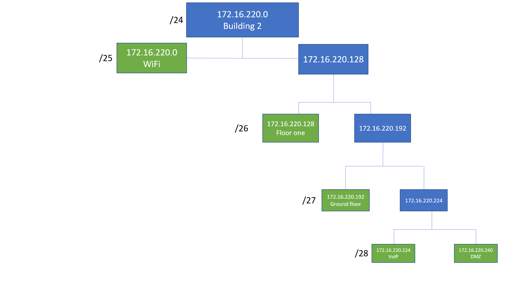
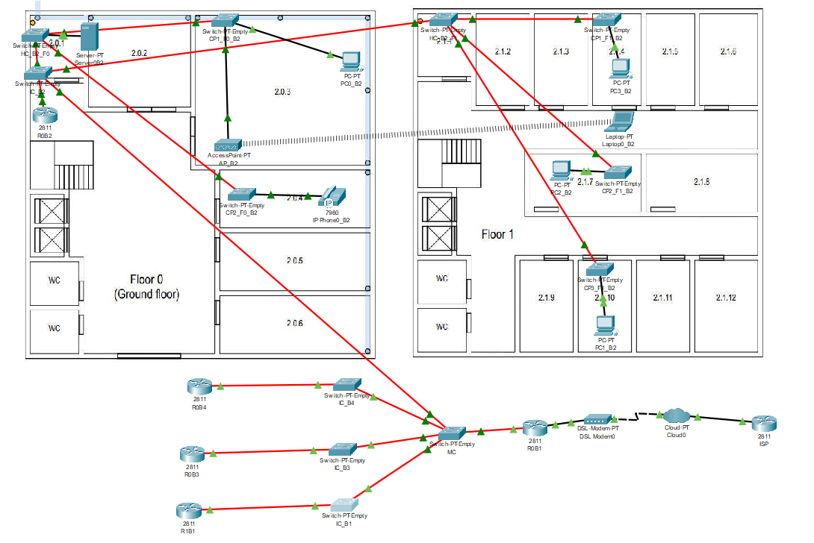
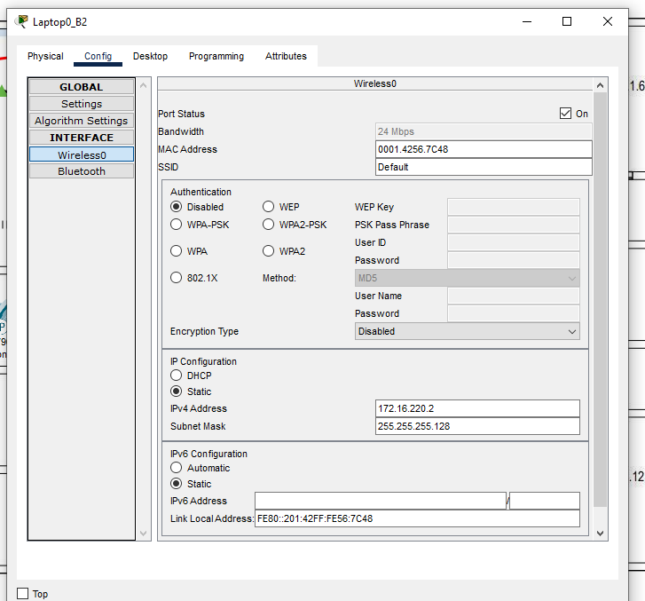
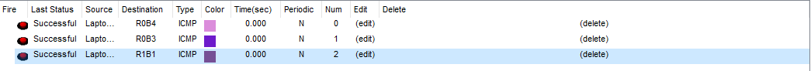
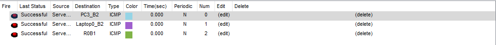

RCOMP 21/22 - Sprint 2 - 1201371
===========================================
This md file will contain all explanations and justifications about the choices taken during the realization of the sprint.
#Building 2
> ##Network addresses and VLAN Database table
> 
> The VLAN's represented in the figure are described in the following table:
> 
> |               |   Id VLAN     | Name VLAN   |  Nodes |  Network address  | Mask| First valid ip  |  Last valid ip  |  Broadcast address |
> |---            |---            |---          |---     |---                |---  |---              |---              |---                 |
> |  WiFi         |    256        |wifib2       |  120   | 172.16.220.0     | /25 |  172.16.220.1    | 172.16.220.126  | 172.16.220.127     |
> |  Floor one    |    258        |fob2         |  50    | 172.16.220.128   | /26 |  172.16.220.129  | 172.16.220.190  | 172.16.220.191     |
> |  Ground Floor |    257        |gfb2         |  25    | 172.16.220.192    | /27 | 172.16.220.193  | 172.16.220.222  | 172.16.220.223     |
> |  VoIP         |    259        |voipb2       |  12    | 172.16.220.224    | /28 | 172.16.220.225  | 172.16.220.238  | 172.16.220.239     |
> |  DMZ          |    260        |dmzb2        |  12    | 172.16.220.240    | /28 | 172.16.220.241  | 172.16.220.254  | 172.16.220.255     |
> The VLAN's were determined by their number of nodes (a VLAN that support more nodes need more valid IP's). As this is a simulation and was used a few number of PC's, there are many IP's unused. The IP's unused allow the building to grow smoothly.

> ##Cisco Packet Tracer simulation
> 
> * As we can see in the picture, for each CP we have at least one pc connected. There are cases where the telephone, and the access point are also connected. 
> * The layout of the simulation followed the same pattern as the defined one of sprint 1. Each PC in the simulation represents all the end-user nodes described in the sprint description. 
> * All communication between switches (can represent HC, IC, CP...) are in truck mode, otherwise, we worked in access mode, thus allowing all switches to access the building's VLANs.
> * As we used 'PT-Empty' switch type, we had to add manually the needed ports to support all connections. For fibre connections we used FFE ports, and for copper connections we used CFE ports.
> * The laptop is connected to the network through a Wi-Fi connection. As the configuration is lost when we close the program, the next figure represents the configuration of the laptop, so it can't be lost.
>
> 
> As we can see, the IP is one of the valid IP's defined for the Wi-Fi VLAN. 
> All switches and routers configuration are saved in configuration files.
>
> ###Testing connections
> To test if all components can connect to each other, we used the 'Add Simple PDU'. The following 3 figures represents it:
> * From PC0:
> 
> * From Laptop:
> 
> * From Server:
> 
>
> ###Building's VLAN devices
> For all VLANs, we have at least 1 device connected to it, to test the connection between all VLANs.
> 
> |               |   Id VLAN     | Name VLAN   |  Devices |
> |---            |---            |---          |---     |
> |  WiFi         |    256        |wifib2       |  AP_B2 and Laptop0_B2   |
> |  Ground Floor |    257        |gfb2         |  PC0_B2    |
> |  Floor one    |    258        |fob2         |  PC1_B2, PC2_B2 and PC3_B2    |
> |  VoIP         |    259        |voipb2       |  IP_Phone0_B2    |
> |  DMZ          |    260        |dmzb2        |  Server0B2    |
>
> ###Routing tables
>
> Each device, when requests to communicate with another device in the network or outside it, has to know what will be to the path to achieve the destination. 
> The routing tables have that function, define the paths to establish a connection between all the services. The following table represents all routing tables associated with their device.
>
> |  Device       |   Network | Next hop    |
> |---            |---            |---          |
> |  R0B2        |    0.0.0.0/0  | 172.16.216.133 |
> | R0B1 |    0.0.0.0/0        |15.203.47.101         |
> | R0B1 |    172.16.220.0/24        |172.16.216.130         |
> | R0B1 |    172.16.221.0/24        |172.16.216.131         |
> | R0B1 |    172.16.222.0/24        |172.16.216.132         |
> | R0B1 |    172.16.217.0/24        |172.16.216.129         |
> | R0B1 |    172.16.216.0/25        |172.16.216.129         |
> | R0B1 |    172.16.218.0/25        |172.16.216.129         |
> |  ISP         |    172.16.216.0/21        |15.203.47.102       |