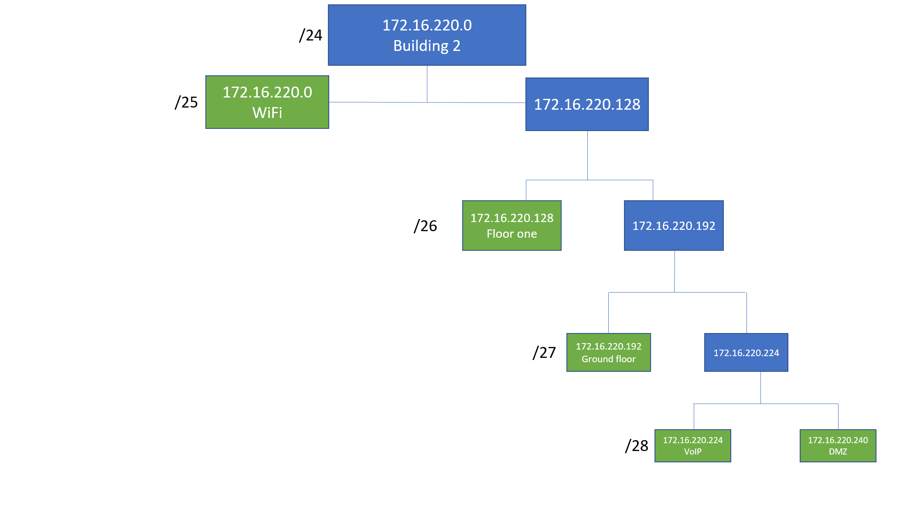

##Network address and VLan Database table

|               |   Id VLAN     | Name VLAN   |  Nodes |  Network address | First valid ip  |  Last valid ip  |  Broadcast address |
|---            |---            |---          |---     |---               |---              |---              |---                 |
|  WiFi         |    256        |wifib2       |  120   | 172.16.220.0     | 172.16.220.1    | 172.16.220.126  | 172.16.220.127     |
|  Floor one    |    258        |fob2         |  50    | 172.16.220.128   | 172.16.220.129  | 172.16.220.190  | 172.16.220.191     |
|  Ground Floor |    257        |gfb2         |  25    | 172.16.220.192   | 172.16.220.193  | 172.16.220.222  | 172.16.220.223     |
|  VoIP         |    259        |voipb2       |  12    | 172.16.220.224   | 172.16.220.225  | 172.16.220.238  | 172.16.220.239     |
|  DMZ          |    260        |dmzb2        |  12    | 172.16.220.240   | 172.16.220.241  | 172.16.220.254  | 172.16.220.255     |

##Network Address Tree

