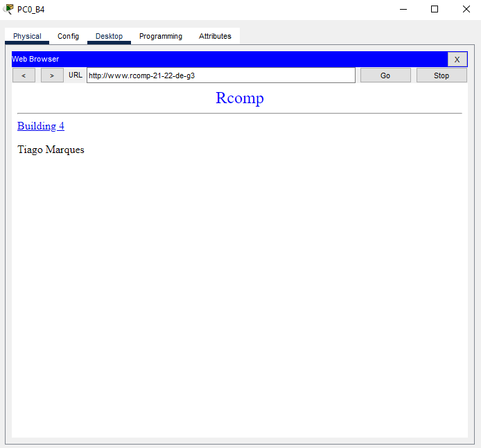
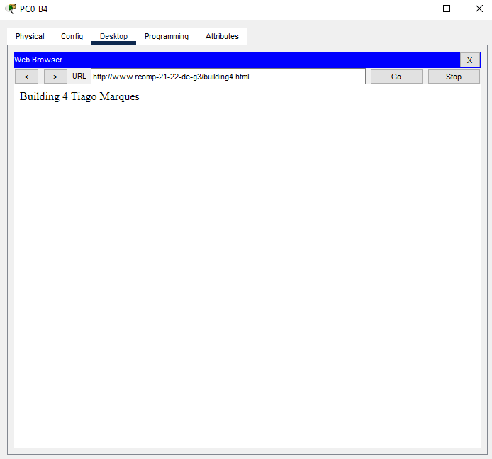

RCOMP 21/22 - Sprint 3 - 1201276
===========================================
This md file will contain all explanations and justifications about the choices taken during the realization of the sprint.
# Building 4
### Glossary
> * OSPF - Open Shortest Path First
> * DHCPv4 - Dynamic Host Configuration Protocol version 4
> * VoIP - Voice over Internet Protocol
> * DMZ - Demilitarized Zone
> * HTTP - Hypertext Transfer Protocol
> * DNS - Domain Name System
> * NAT - Network Address Translation

### OSPF dynamic routing
> router ospf 3 
> log-adjacency-changes 
> network 172.16.216.128 0.0.0.127 area 0 
> network 172.16.222.0 0.0.0.255 area 4 

### HTTP server

> 
> 

### DHCPv4 service
> ip dhcp excluded-address 172.16.222.1 
> ip dhcp excluded-address 172.16.222.129 
> ip dhcp excluded-address 172.16.222.193 
> ip dhcp excluded-address 172.16.222.225 
> 
> ip dhcp pool wifib4 
> network 172.16.222.0 255.255.255.128 
> default-router 172.16.222.1 
> dns-server 172.16.222.242 
> domain-name rcomp-21-22-de-g3 
> 
> ip dhcp pool fob4 
> network 172.16.222.128 255.255.255.192 
> default-router 172.16.222.129 
> dns-server 172.16.222.242 
> domain-name rcomp-21-22-de-g3 
>  
> ip dhcp pool gfb4 
> network 172.16.222.192 255.255.255.224 
> default-router 172.16.222.193 
> dns-server 172.16.222.242 
> domain-name rcomp-21-22-de-g3 
>  
> ip dhcp pool voipb4 
> network 172.16.222.224 255.255.255.240 
> default-router 172.16.222.225 
> option 150 ip 172.16.222.225 
> dns-server 172.16.222.242 

###VOIP service
> dial-peer voice 1 voip 
> destination-pattern 1... 
> session target ipv4:172.16.216.129 
> 
> dial-peer voice 2 voip 
> destination-pattern 2... 
> session target ipv4:172.16.216.130 
> 
> dial-peer voice 3 voip 
> destination-pattern 3... 
> session target ipv4:172.16.216.131 
> 
> telephony-service 
> max-ephones 20 
> max-dn 20 
> ip source-address 172.16.222.225 port 2000 
> auto assign 11 to 12 
> 
> ephone-dn 11 
> number 4000 
> 
> ephone-dn 12 
> number 4001 
> 
> ephone 1 
> device-security-mode none 
> mac-address 00D0.D3CE.E3DA 
> type 7960 
> button 1:11 
> 
> ephone 2 
> device-security-mode none 
> mac-address 00D0.D306.38C2 
> type 7960 
> button 1:12 

### DNS

> 

### NAT
> ip nat inside source static tcp 172.16.222.243 80 172.16.216.132 80  
> ip nat inside source static tcp 172.16.222.243 443 172.16.216.132 443  
> ip nat inside source static tcp 172.16.222.242 53 172.16.216.132 53  
> ip nat inside source static udp 172.16.222.242 53 172.16.216.132 53 
 
 
 
